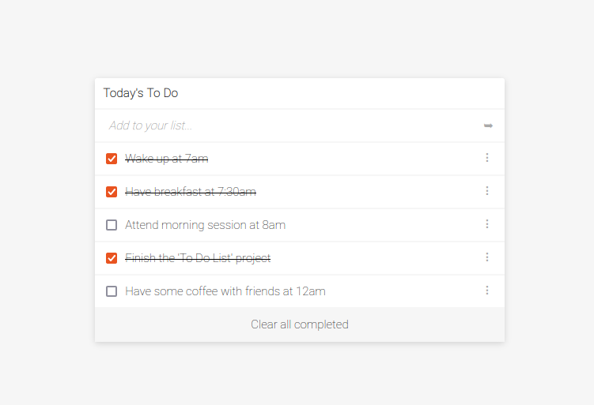

# To Do List App

> I am creating a to do list app as part of Microverse project

"To Do List" is a simple app that help you record and manage tasks. You can create a new task, update it, mark it as complete, order in terms of priority and delete them when completed.

## Built With

- HTML
- CSS
- JavaScript
- Webpack

## Live Demo

[Live Demo Link](https://patriciachrysy.github.io/javascript-to-do-list/dist/)

## Getting Started

Clone the project from here. Make sur you have the latest version of NodeJS en npm installed locally.

Run the following commands as listed in your terminal:
- npm install
- npm run build
- npm start

**Feel free to discover the code and help us improve it**

## Author

👤 **Patricia**

- GitHub: [@githubhandle](https://github.compatriciachrysy)

## 🤝 Contributing

Contributions, issues, and feature requests are welcome!

## Show your support

Give a ⭐️ if you like this project!

## Acknowledgments

- Great team work on the project in Pair Programming
- Thank you for Microverse for providing the required materials

## 📝 License

This project is [MIT](./MIT.md) licensed.
